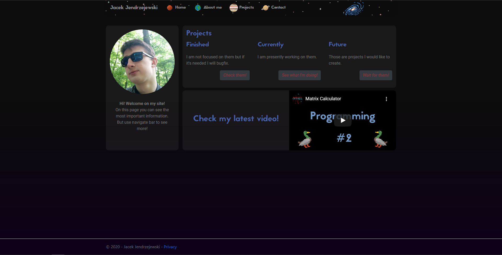

# Portfolio website

> My first web project. Made with ASP .NET Core. It represents my personality and my projects.

## Table of contents

- [Portfolio website](#portfolio-website)
  - [Table of contents](#table-of-contents)
  - [General info](#general-info)
  - [Technologies](#technologies)
  - [Features](#features)
  - [Screenshots](#screenshots)
  - [Status](#status)
  - [Why did I create it](#why-did-i-create-it)
  - [Contact](#contact)

## General info

This project was made in order to present the things I make and my selfhood. Top navbar is used for page navigation. There are 4 pages for now. [I invite you to visit it](https://jacek-jendrzejewski.azurewebsites.net/) :)

_The website is hosted on Azure (free package - so it can load long)_

## Technologies

* .NET Core 3.1
* Bootstrap 4.3.1
* HTML
* CSS

## Features

* [Home site](https://jacek-jendrzejewski.azurewebsites.net/)
  * Welcome page with projects panel and my latest YouTube video
* [About me](https://jacek-jendrzejewski.azurewebsites.net/AboutMe)
  * Page where you can know me bettter and see technologies I have learned
* [Projects](https://jacek-jendrzejewski.azurewebsites.net/Projects)
  * Page for presenting my done/wip/future projects
  * Every done/wip project has links to YouTube video and GitHub repository
* [Contact](https://jacek-jendrzejewski.azurewebsites.net/Contact)
  * As you may guess, you can find here ways to contact me
  * But also links to my social media such as LinkedIn or Facebook

To upgrade:

* Add Polish language (and option to change it)
* Add panel to home page with news about [my game](https://github.com/ovrael/Architects-Dream)

## Screenshots

## Status

Project is _expansionable_.

That means it is finished and I like how it works. But I am open to any issues connected to it (such as bug fix or adding new features in the long long future).

Additionally because this is my site I have an eye on it and it will be constantly developed.

## Why did I create it

I wanted two things: learn ASP .NET and have my website. So I connected them and this is it.

## Contact

You can find contact information [here](https://jacek-jendrzejewski.azurewebsites.net/Contact).
